# Active Directory Lab

This lab will demonstrate the process of setting up a **Domain Controller** and a **Client VM** in Azure. We will walk through the installation of **Active Directory**, configuration of group policies, creation of users, and troubleshooting of account lockouts.

## Setup Domain Controller in Azure

1. **Create a Resource Group**
   - In the Azure Portal, navigate to "Resource Groups" and click "Add".
   - Provide a name for the resource group and choose the appropriate region.
   - Click "Review + Create" and then "Create" to finalize the resource group.
  
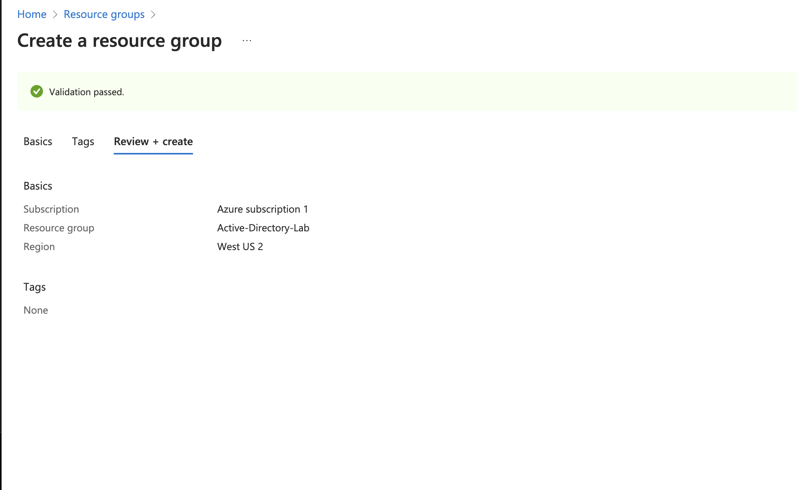

2. **Create a Virtual Network and Subnet**
   - In the Azure Portal, go to "Virtual Networks" and click "Add".
   - Provide a name for the Virtual Network and select the previously created resource group.
   - Configure the Address Space, Subnet Name, and Subnet Address Range.
   - Click "Review + Create" and then "Create" to create the virtual network and subnet.

3. **Create the Domain Controller VM (Windows Server 2022) named “DC-1”**
   - Navigate to the "Virtual Machines" section and click "Add".
   - Select the image as "Windows Server 2022".
   - Provide the VM name as "DC-1".
   - Set the username as `labuser` and password as `Password123!`.
   - Assign the VM to the previously created Virtual Network and Subnet.
   - Configure any additional settings as needed, then click "Review + Create" and "Create" to deploy the VM.

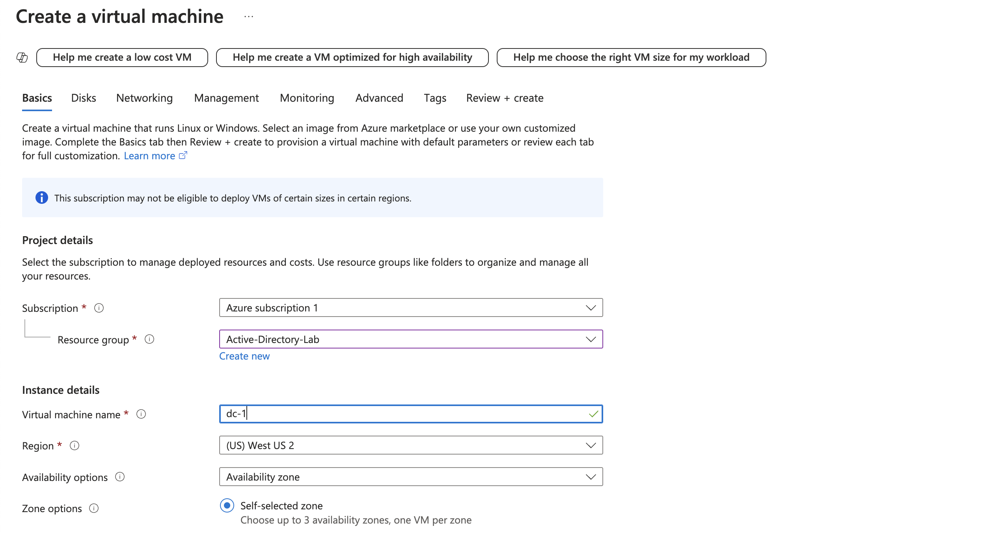

4. **Set Domain Controller’s NIC Private IP Address to Static**
   - After the VM is deployed, go to the "Networking" section of the VM in the Azure Portal.
   - Locate the Network Interface Card (NIC) and click on it.
   - In the NIC settings, set the Private IP Address to "Static" to ensure it remains constant.
  
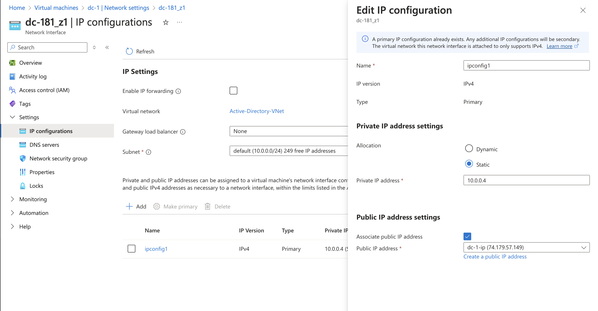

5. **Log into the VM and Disable the Windows Firewall (for testing connectivity)**
   - Connect to the "DC-1" VM using Remote Desktop Protocol (RDP).
   - Once logged in, open the "Windows Firewall" settings.
   - Temporarily disable the firewall for testing purposes.

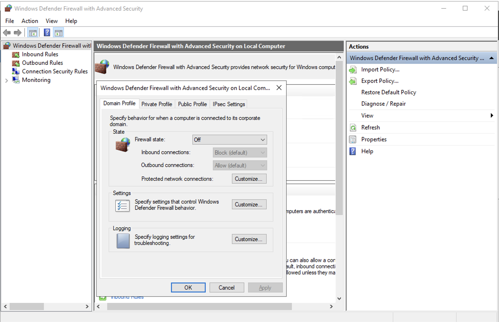

## Setup Client-1 in Azure

1. **Create the Client VM (Windows 10) named “Client-1”**
   - Navigate to the "Virtual Machines" section and click "Add".
   - Select the image as "Windows 10".
   - Provide the VM name as "Client-1".
   - Set the username as `labuser` and password as `Password123!`.
   - Assign the VM to the same region and Virtual Network as "DC-1".
   - Click "Review + Create" and then "Create" to deploy the Client VM.

2. **Set Client-1’s DNS Settings to DC-1’s Private IP Address**
   - After the VM is created, navigate to the "Networking" section of the "Client-1" VM in the Azure Portal.
   - Under "DNS Servers", change the setting to the static private IP address of "DC-1".
  
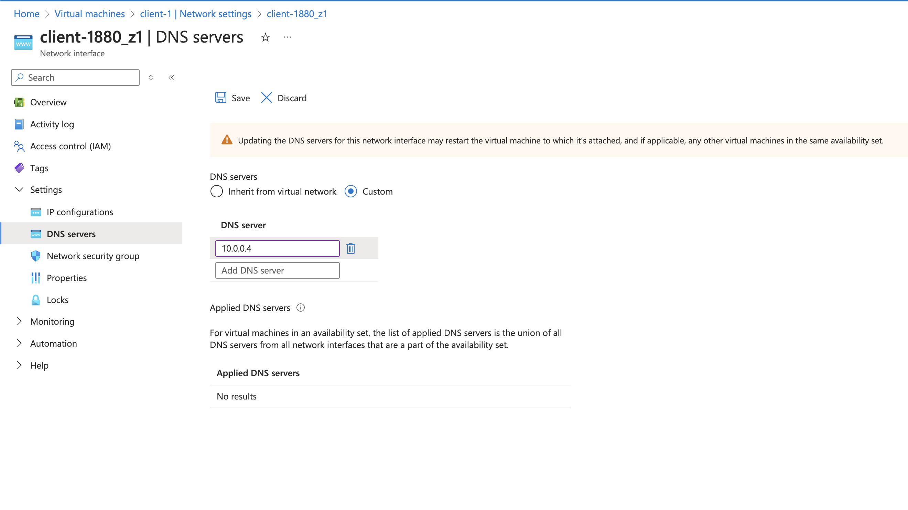

3. **Restart Client-1 from the Azure Portal**
   - From the Azure Portal, go to the "Overview" page of "Client-1".
   - Click on "Restart" to reboot the client VM.

4. **Login to Client-1**
   - Connect to the "Client-1" VM using RDP and log in with the username `labuser` and password `Password123!`.

5. **Attempt to Ping DC-1’s Private IP Address**
   - Open a command prompt or PowerShell window on "Client-1".
   - Run the following command to test connectivity:
     ```
     ping <DC-1_Private_IP>
     ```
   - Ensure the ping is successful.

6. **Check DNS Settings on Client-1**
   - From PowerShell on "Client-1", run the following command:
     ```
     ipconfig /all
     ```
   - Verify that the DNS settings show the private IP address of "DC-1".
  
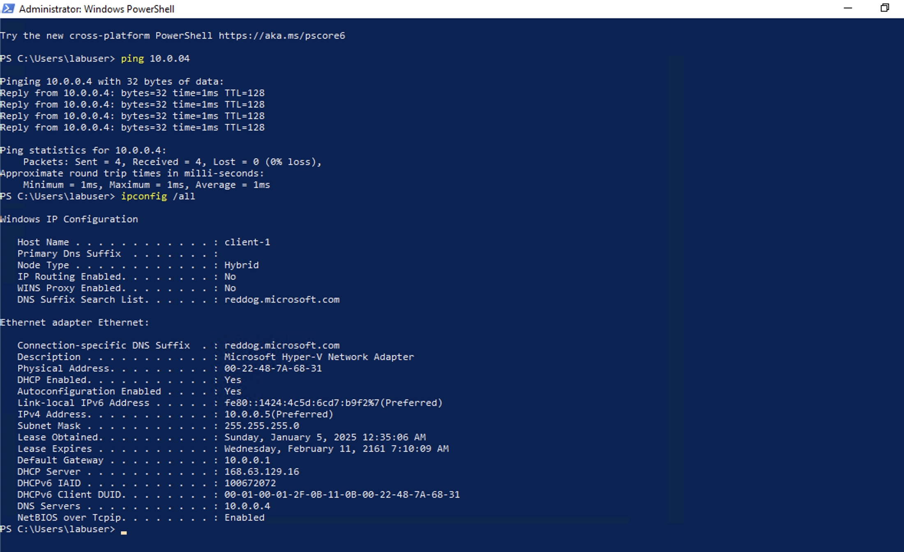
     

# Installing Active Directory and Managing Users in Azure

## Part 1: Install Active Directory and Create Domain Admin User

### 1. Turn on the DC-1 and Client-1 VMs
- If the DC-1 and Client-1 VMs are turned off in the Azure Portal, navigate to the **Virtual Machines** section.
- Locate both **DC-1** and **Client-1** VMs and click "Start" to turn them on.

### 2. Install Active Directory on DC-1
- Log into **DC-1** using Remote Desktop (RDP).
- Open **Server Manager**, and select **Add Roles and Features**.
- In the **Add Roles and Features Wizard**, select **Active Directory Domain Services** and complete the installation process.

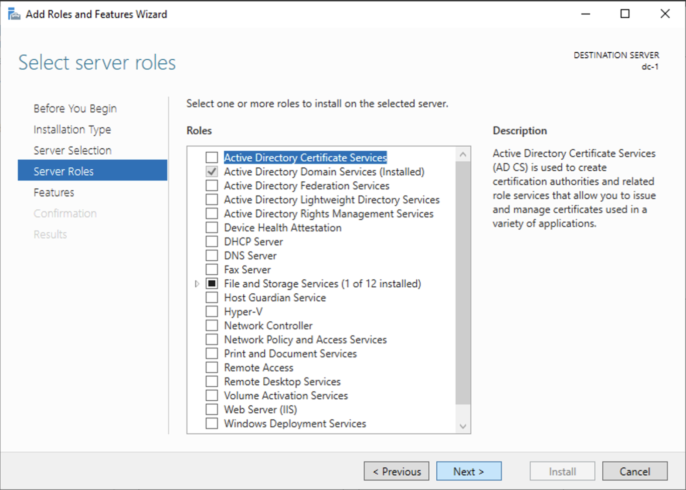

- Once the installation is complete, click on the **Promote this server to a domain controller** link.
- Set up a **new forest** with the domain name `mydomain.com` (or any name you prefer, but remember it).

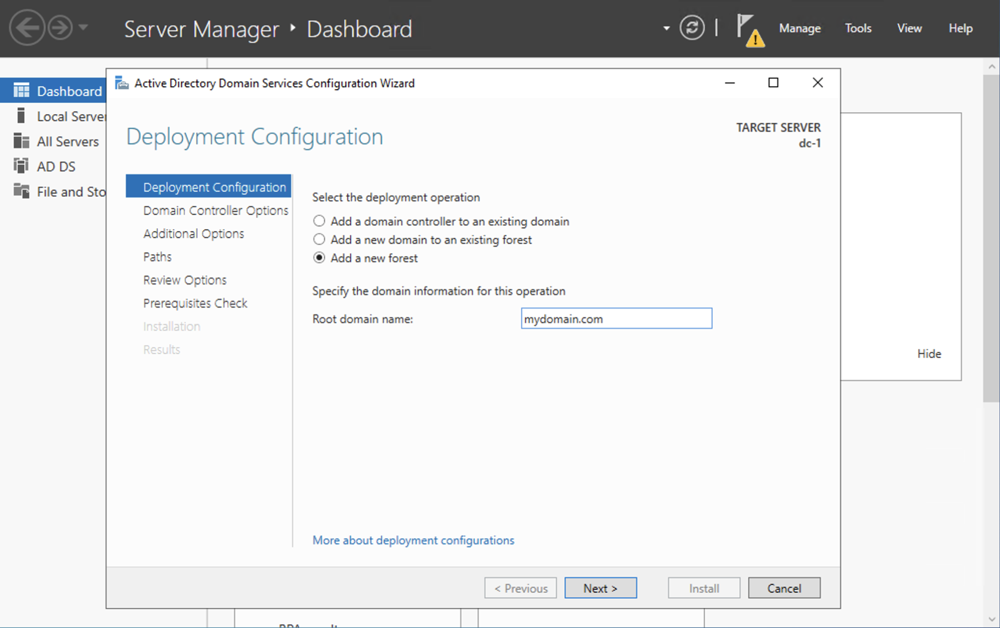

- Complete the configuration and allow the system to restart.

### 3. Log back into DC-1 as a Domain User
- After the restart, log back into **DC-1** using the domain credentials:
  - Username: `mydomain.com\labuser`
  - Password: `Password123!`

### 4. Create Domain Admin User
- On **DC-1**, open **Active Directory Users and Computers (ADUC)**.
- Right-click on the **mydomain.com** domain and select **New** → **Organizational Unit**.
  - Name the first OU as `_EMPLOYEES` and click "OK".
  - Create another Organizational Unit (OU) called `_ADMINS`.
- Inside the **_EMPLOYEES** OU, create a new user named **Jane Doe** with the following details:
  - Username: `jane_admin`
  - Password: `Password123!`
 
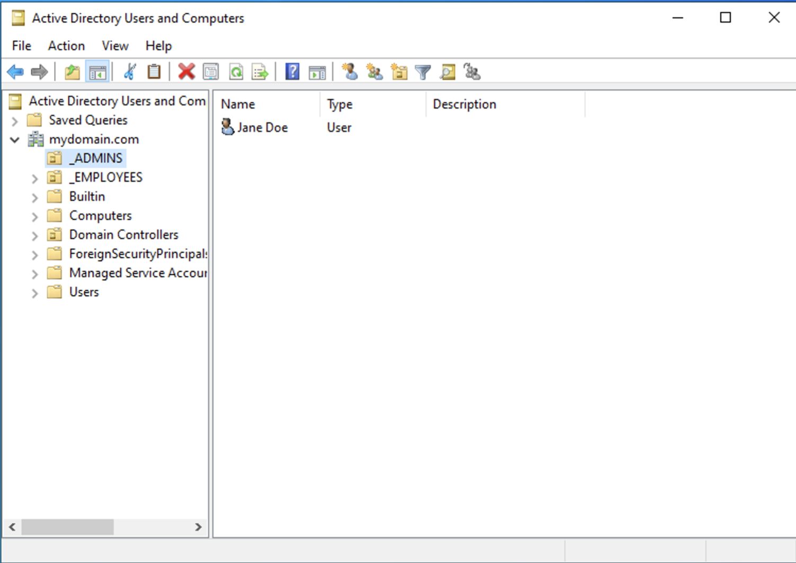

- Right-click on **jane_admin** and add them to the **Domain Admins** security group.

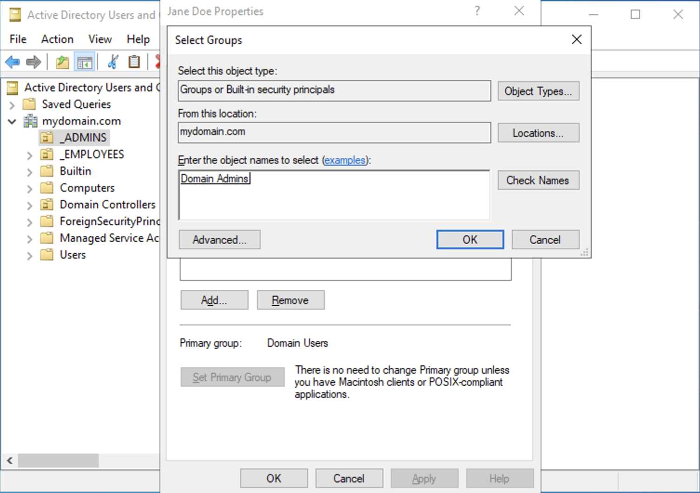

- Log out from **DC-1** and log back in using the new admin credentials:
  - Username: `mydomain.com\jane_admin`
  - Password: `Password123!`
- You will now use **jane_admin** as your admin account for future tasks.

### 5. Join Client-1 to the Domain
- From the Azure Portal, ensure that **Client-1** has **DC-1’s Private IP** set as its DNS server (this should already be done).
- Restart **Client-1** if not already restarted (this should have been done in a previous step).
- Log into **Client-1** using the local admin account (`labuser`), and join the machine to the domain (`mydomain.com`).

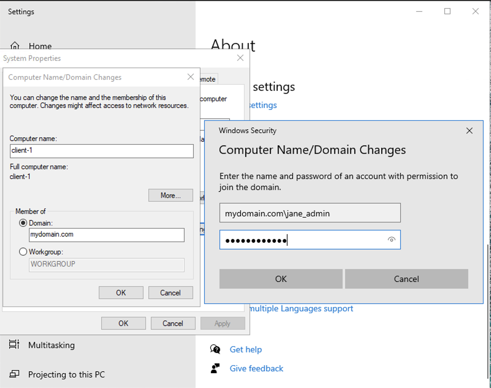

- The machine will automatically restart after joining the domain.

### 6. Verify Domain Joining in Active Directory
- Log into **DC-1** and open **Active Directory Users and Computers (ADUC)**.
- Verify that **Client-1** appears in the list of machines under **mydomain.com**.


- Create a new **Organizational Unit (OU)** named **_CLIENTS** in **ADUC**.
- Drag and drop **Client-1** into the **_CLIENTS** OU.

### 7. Finish the Lab and Save VMs
- When you finish the lab, do not delete the VMs in Azure; they will be used for future labs.
- If you are done for the day and want to save costs, navigate to the Azure Portal and **Stop** or turn off both **DC-1** and **Client-1** VMs.

---

## Part 2: Configure Remote Desktop for Non-Admin Users and Create Additional Users

### 1. Turn on the DC-1 and Client-1 VMs (if off)
- If the DC-1 and Client-1 VMs are off, navigate to the **Virtual Machines** section of the Azure Portal and **Start** both VMs.

### 2. Set up Remote Desktop for Non-Administrative Users on Client-1
- Log into **Client-1** as `mydomain.com\jane_admin`.
- Right-click on **This PC** and select **Properties**.
- Under **System**, click on **Remote Settings**.
- In the **System Properties** window, go to the **Remote Desktop** tab.
- Select **Allow remote connections to this computer**.
- Under **Select Users**, click **Add**, and then type **domain users** to allow all domain users access.
- Click **OK** to save the changes.
- You can now log into **Client-1** using a non-administrative user account.

### 3. Create Additional Users and Log into Client-1
- Log into **DC-1** as `mydomain.com\jane_admin`.
- Open **PowerShell ISE** as an administrator.
- Create a new PowerShell script to automate user creation. Paste the following script:

```powershell
# ----- Edit these Variables for your own Use Case ----- #
$PASSWORD_FOR_USERS   = "Password1"
$NUMBER_OF_ACCOUNTS_TO_CREATE = 10000
# ------------------------------------------------------ #

Function generate-random-name() {
    $consonants = @('b','c','d','f','g','h','j','k','l','m','n','p','q','r','s','t','v','w','x','z')
    $vowels = @('a','e','i','o','u','y')
    $nameLength = Get-Random -Minimum 3 -Maximum 7
    $count = 0
    $name = ""

    while ($count -lt $nameLength) {
        if ($($count % 2) -eq 0) {
            $name += $consonants[$(Get-Random -Minimum 0 -Maximum $($consonants.Count - 1))]
        }
        else {
            $name += $vowels[$(Get-Random -Minimum 0 -Maximum $($vowels.Count - 1))]
        }
        $count++
    }

    return $name
}

$count = 1
while ($count -lt $NUMBER_OF_ACCOUNTS_TO_CREATE) {
    $fisrtName = generate-random-name
    $lastName = generate-random-name
    $username = $fisrtName + '.' + $lastName
    $password = ConvertTo-SecureString $PASSWORD_FOR_USERS -AsPlainText -Force

    Write-Host "Creating user: $($username)" -BackgroundColor Black -ForegroundColor Cyan
    
    New-AdUser -AccountPassword $password `
               -GivenName $firstName `
               -Surname $lastName `
               -DisplayName $username `
               -Name $username `
               -EmployeeID $username `
               -PasswordNeverExpires $true `
               -Path "ou=_EMPLOYEES,$(([ADSI]`"").distinguishedName)" `
               -Enabled $true
    $count++
}
```

- Save the PowerShell script and run it to create the new user accounts.
- After running the script, open **Active Directory Users and Computers (ADUC)**.
- Verify that the newly created users appear under the **_EMPLOYEES** Organizational Unit (OU).

### 4. Test User Login on Client-1
- Once the users are created, attempt to log into **Client-1** using one of the newly created user accounts.
  - Use the format: `mydomain.com\<username>` and the password defined in the script.
- Verify that the login is successful and the user is able to access **Client-1**.


# Handling Account Lockouts, Enabling/Disabling Accounts, and Observing Logs

## 1. Turn on the DC-1 and Client-1 VMs
- If the **DC-1** and **Client-1** VMs are off in the Azure Portal, navigate to the **Virtual Machines** section.
- Locate **DC-1** and **Client-1** and click "Start" to turn on both VMs.

---

## 2. Resolving Account Lockouts

### 2.1 Get Logged into DC-1
- Log into **DC-1** using the appropriate credentials.

### 2.2 Pick a Random User Account
- Select a user account that you created previously.

## 3. Configure Group Policy to Lock Out Accounts After 5 Attempts

### 3.1 How to Configure Account Lockout Threshold in Group Policy
- Open **Group Policy Management**.
- Navigate to **Computer Configuration** → **Policies** → **Windows Settings** → **Security Settings** → **Account Lockout Policy**.
- Set **Account Lockout Threshold** to **5 invalid login attempts**.
- Apply the policy and close the Group Policy editor.

### 3.2 Attempt to Log in with Bad Password 6 Times
- Try logging into the user account 6 times with an incorrect password.
- Observe that the account is now locked out after the 5th failed attempt.

### 3.3 Observe Account Lockout in Active Directory
- Open **Active Directory Users and Computers (ADUC)** on **DC-1**.
- Check the selected user account to confirm that it is locked out.
  
### 3.4 Unlock the Account
- Right-click the locked-out account in **ADUC** and choose **Properties**.
- In the **Account** tab, uncheck **Account is locked out**.
- Click **OK** to unlock the account.

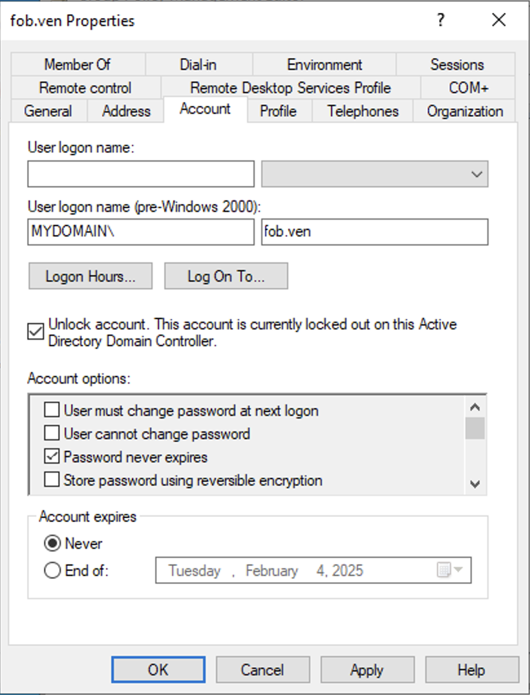

### 3.5 Reset the Password and Attempt to Log In
- Reset the password for the account to a new one.
- Attempt to log in with the new password to confirm the account is now accessible.

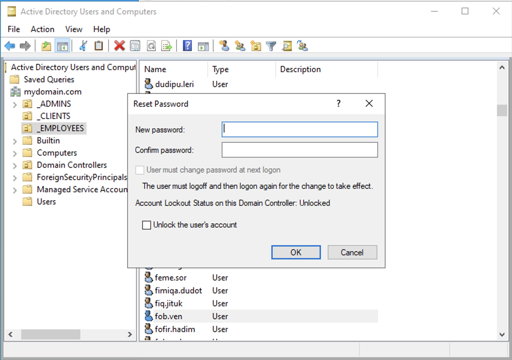

---

## 4. Enabling and Disabling Accounts

### 4.1 Disable the Same Account in Active Directory
- Right-click the selected user account in **ADUC** and select **Disable Account**.

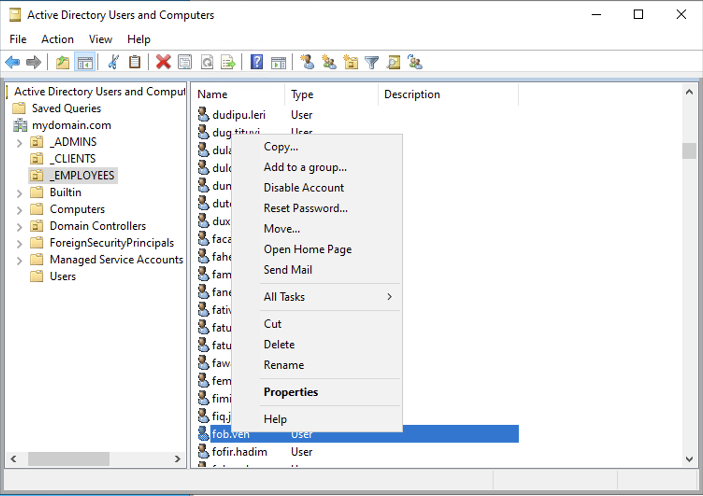

### 4.2 Attempt to Log in with the Disabled Account
- Try logging into **Client-1** using the disabled account.
- Observe the error message that indicates the account is disabled.

### 4.3 Re-enable the Account and Attempt to Log In
- Right-click the disabled account in **ADUC** and select **Enable Account**.
- Attempt to log into the account again to confirm it is re-enabled.

---

## 5. Observing Logs

### 5.1 Open Event Viewer on the Domain Controller
- On **DC-1**, press `Start` → `Run`, and type `eventvwr.msc` to open the **Event Viewer**.
- Review the security logs for events related to failed login attempts and account lockouts.

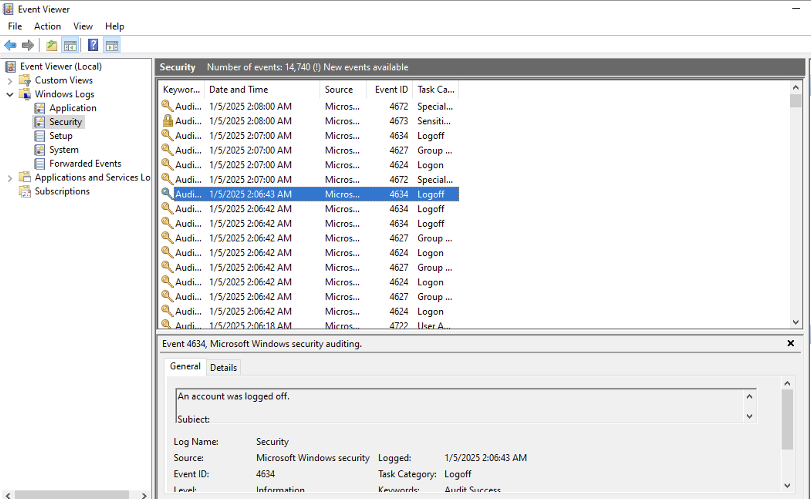

### 5.2 Observe Logs on the Client Machine
- On **Client-1**, press `Start` → `Run`, and type `eventvwr.msc` to open the **Event Viewer**.
- Observe the logs for any entries related to failed login attempts and account lockouts on the client machine.


